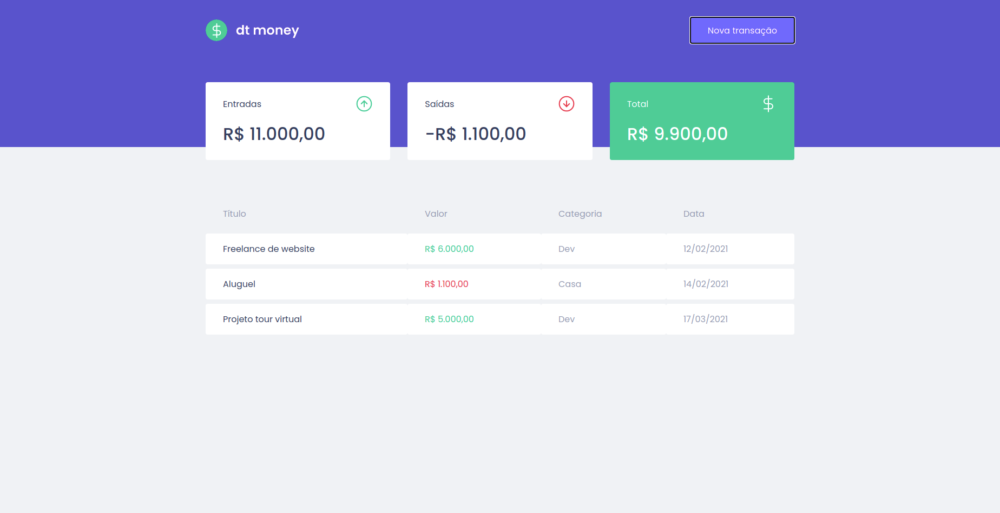
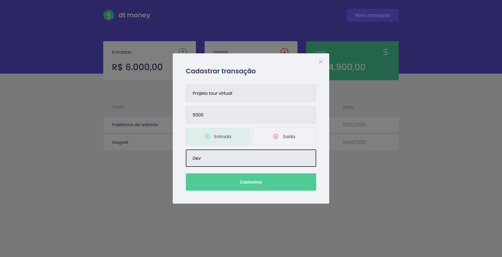

<div align=center>

<h3>

Projeto desenvolvido no Programa Ignite - Trilha ReactJS - da [Rocketseat], com **HTML**, **CSS**, **JAVASCRIPT**, **ReactJS** e **Typescript**.

</h3>




</div>

## 📚 **Sobre**

O dtmoney é uma aplicação de gerenciamento de finanças, que permite o cadastro de entradas e saídas, bem como, realiza o cálculo do respectivo saldo.

<br>

## ✅ **Funcionalidades**
- Adicionar transação;
- Categorização da transação;
- Cálculo do saldo;

## ⏲️ **Próximas Funcionalidades**
- Remover transação;
- Theme Dark;

<br>

### 📌  **Tecnologias utilizadas**
- React
- Styled-component
- MirageJS
- Axios
- Context API

<br>
<br>

### 🚀 **Mão na massa**

```bash
# Clone este repositório
$ git clone https://github.com/Joao-Augusto-Oliveira/dtmoney

# Acesse a pasta do projeto no terminal/cmd
$ cd dtmoney

# Instale as dependências
$ yarn

# Execute a aplicação em modo de desenvolvimento
$ yarn start


```

<br>
<br>

<h3 align="center">
Feito com 💜 por <a href="https://www.linkedin.com/in/joão-augusto-oliveira-dos-santos-9b0693195">João Augusto</a>
<br><br>
 
  
</a>
</h3>

<!-- Links -->

[Rocketseat]: https://rocketseat.com.br/


